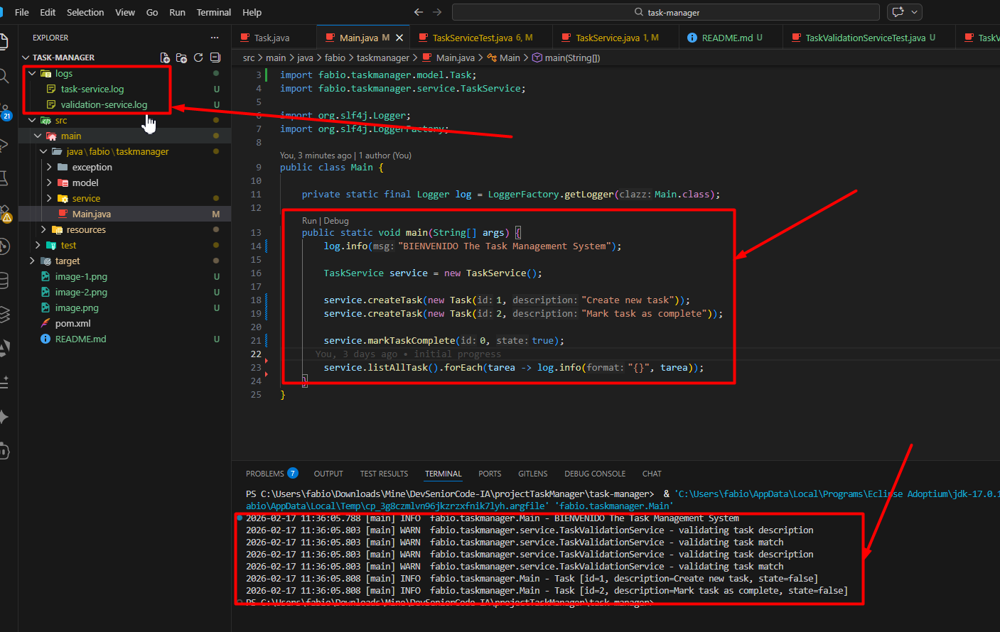

System Task Manager
📚 Descripción del Proyecto
Este es una aplicacion Java de consola llamada TaskManager. El sistema permitira administrar una lista de tareas pendientes, aplicando buenas practicas de programacion profesional con validaciones de negocio.

🎯 Objetivos del Proyecto
Demostrar el desarrollo de una aplicacion Java que permita crear, listar, completar y eliminar tareas.
Manejar excepciones
Uso de loggin profesional
Aplicar Test-Driven Development (TDD) y pruebas unitarias
Implementar reglas de negocio con validaciones
Practicar diseño de clases y servicios

📋 Requerimientos funcionales
Registrar tareas: Id unico, descripcion y estado
Buscar tareas: Por id
Listar tareas: Listar Todas las tareas registradas
Marcar tarea: Marcar una tarea completada de acuerdo al id
Eliminar tarea: Eliminar una tarea de acuerdo al id

💻▶️ Ejecucion y evidencias del proyecto
Se ejecuta la clase prinicipal que nos permite llevar a cabo la ejecución de la aplicación y poder observar la creacion tatno de los Log,
como de cierta informacion por consola

